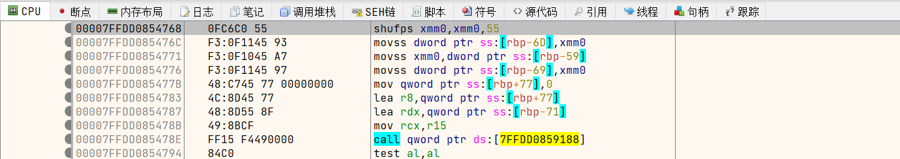
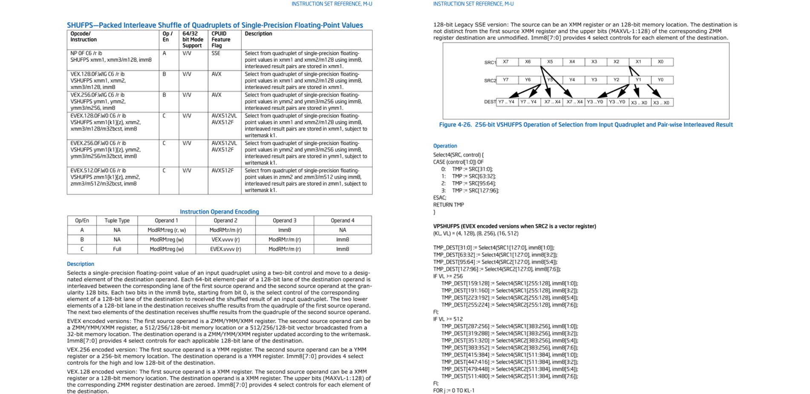

# x128dbg

**x128dbg** 是一个 **x64dbg** 的插件，随着时间的推移，它会有越来越多的功能

目前的 **x128dbg** 的版本为 **v1** ，它提供了查看汇编指令手册的功能

#### 查看汇编指令手册

有时，我们在使用 **x64dbg** 调试时，会碰到不认识的汇编指令（即使开启了 **x64dbg** 自带的 **Ctrl+Shift+F1** 显示指令提示功能也无济于事），我们拿 **shufps** 指令为例

当我们上网搜索时，却发现了这种方式的弊端

网上的信息繁杂且质量参差不齐，其中某度搜索引擎更是被XXDN、XX园、某机翻StackOverflow网站等给霸占了首页

我们为了了解指令的详细信息不得不面临大海捞针、真假难辨的风险

有的文章用粗陋的寥寥几字就概况了一条指令，更有的文章仅凭作者主观臆断就信笔写下了错误的字句

我们不禁想到，为什么不查看 **Intel** 官方指令手册呢？

**x128dbg** 提供了便捷的快捷键和准确无误的官方手册，遇到不清楚的指令，只需按下 **/** 键即可快速查看汇编指令手册

通过按下快捷键，可以直接打开对应指令的官方文档页面，其中清晰的记录了指令的操作数、字节码、描述、所需架构环境、副作用、中断相关，更有图文并茂的介绍和指令内部工作机制

**x128dbg** 提供了查看本地手册和查看网络手册两种模式，可以通过按下 **Ctrl+Alt+/** 快捷键切换

插件会自动检测 **plugins\x128dbg** 目录下是否存在 **manual** 目录，若存在，则默认使用本地手册，否则默认使用网络手册

插件默认提供了一个网络手册Url，由作者维护，因为是一台5M带宽的服务器，不支持太多人同时访问，因此有条件的可以自己搭建一个网络手册网站，通过在 **plugins\x128dbg** 目录下创建 **manual.txt** ，在其中填入自己的网站Url即可（注意：Url必须在txt的第一行，以 **http(s)://** 开头，以 **/manual/** 结尾）

通过解压本地手册压缩包并将 **manual** 目录放在 **plugins\x128dbg** 目录下，可以使用本地手册

网络手册不会占用硬盘空间，但是需要联网且加载速度视情况而定，本地手册需要占用硬盘空间，但是可以零流量秒打开

目前该功能支持从 [Intel官方手册](https://software.intel.com/content/www/us/en/develop/download/intel-64-and-ia-32-architectures-sdm-combined-volumes-1-2a-2b-2c-2d-3a-3b-3c-3d-and-4.html) 中获取的共1089条汇编指令

#### BUG与建议

受限于作者的精力与技术，不敢保证该插件100%完美，如果你有发现任何 **BUG** 或者有更好的 **建议** ，欢迎联系作者 ┗|｀O′|┛ 嗷~~